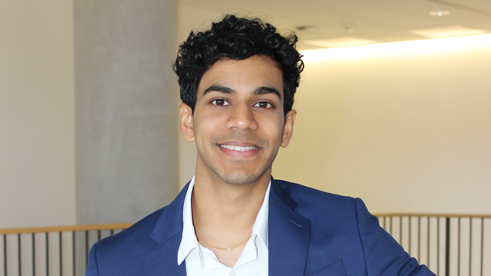

 
    

 <b>Sree Gudala</b>   <em>Graduate Research Student</em> 

 <a href="https://oden.utexas.edu" target="blank">Oden Institute for Computational Engineering and Sciences</a> 
<a href="https://utexas.edu" target="blank">The University of Texas at Austin</a>

 

I grew up in the Houston area and attended The University of Texas at Austin where I obtained my B.S. in Physics with a focus on Nuclear Engineering. I started the CSEM program in Fall 2023. My current research interests lie in the simulation and modeling of advanced nuclear reactors. I work with [Dr. Kevin Clarno](https://www.me.utexas.edu/people/faculty-directory/clarno). You can find out more about our work here [Molten Salt Reactor Initiative](https://sites.utexas.edu/msrdt/). 
